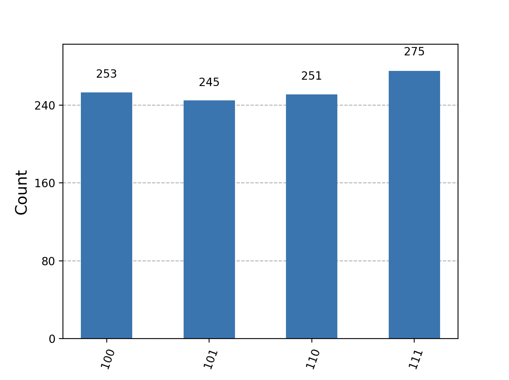

# 🔗 Quantum Teleportation Simulation

This project simulates **Quantum Teleportation** using **Qiskit**. It demonstrates how quantum information can be transferred between two parties (Alice & Bob) using entanglement and classical communication.

## 📌 Features
- Implements **Quantum Teleportation** for a **1-qubit quantum state**.
- Uses **entanglement and classical communication** for state transfer.
- Runs on the **Qiskit AerSimulator**.
- Displays a **histogram** of measurement results.

## 🛠️ Requirements
Ensure you have the following installed:

- Python (>=3.8)
- Qiskit (>=1.2)
- Matplotlib (for visualization)

## 📜 Code Explanation
1. Entanglement Setup:
- Creates a 3-qubit quantum circuit.
- Qubit 1 and 2 are entangled using a Hadamard & CNOT gate.

2. Quantum State Preparation:
- Alice prepares a qubit (qubit 0) in a random state.

3. Teleportation Protocol:
- Alice applies CNOT & Hadamard gates, then measures qubits.
- Measurement results are sent classically to Bob.
  
4. Bob's Correction:
- Bob applies the correct quantum gates based on Alice’s results.
- The original quantum state is successfully reconstructed at Bob’s side.

5. Results & Visualization:
- The measurement outcomes are plotted as a histogram.

## 📊 Output

## 🏗️ Future Enhancements
- Extend teleportation to multi-qubit states.
- Implement real quantum hardware execution.
- Add a GUI interface to visualize the teleportation process.

  
## 📜 License
- This project is licensed under the MIT License.

